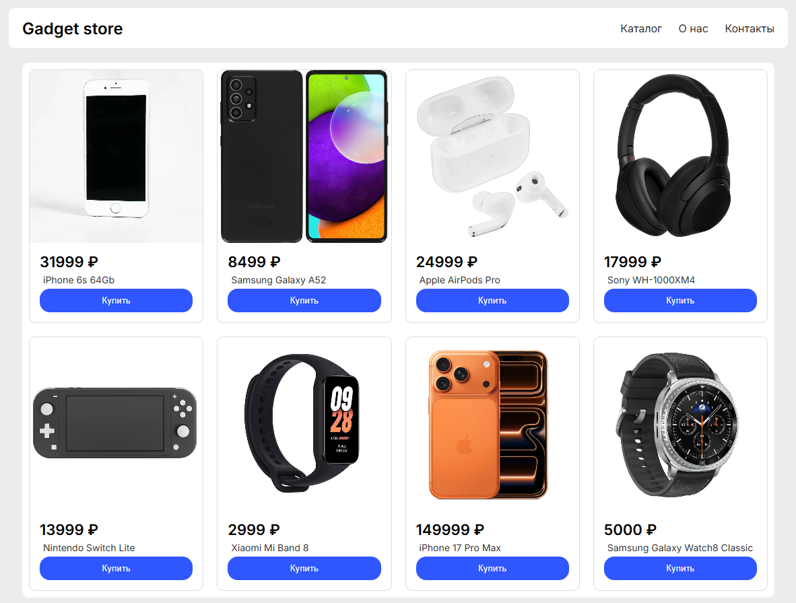

# Gadget Store Catalog (HTML/CSS)

Адаптивный каталог интернет-магазина с интерактивной модалкой.

<a href="https://purecodeee.github.io/Gadget-Store-UI/">ссылка</a>

## 📌 О проекте

Это простой каталог товаров, сверстанный на чистых **HTML + CSS + JS**.
Проект создан для практики современной верстки и сборки портфолио.

✨ Возможности

* адаптивная сетка товаров (CSS Grid)
* карточки с изображениями и описанием
* одинаковые пропорции изображений (`aspect-ratio`)
* hover-эффекты и анимации
* адаптация под мобильные устройства
* закрытие по Esc и клику вне окна
* чистая архитектура JS
* анимации появления

## 🛠️ Технологии

* HTML5
* CSS3 (Grid, Flexbox, transitions)
* Vanilla JavaScript (DOM, events)

## 📷 Скриншот

